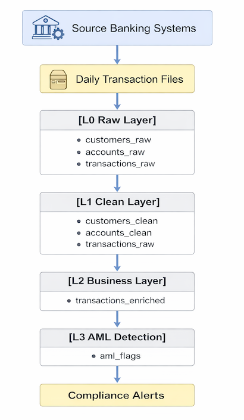

# AML Banking ETL Pipeline

## Overview

This project is a **batch ETL pipeline for Anti-Money Laundering (AML) monitoring** in a banking environment.
It follows a traditional **layered data warehouse architecture** used in many financial institutions and consulting projects.

The pipeline ingests daily transaction files, processes them through multiple transformation layers, and identifies suspicious transactions using **rule-based AML detection logic**.

The implementation replicates the workflow typically followed by ETL teams working on **banking compliance and regulatory reporting systems**.

---

## Architecture

The pipeline follows a **multi-layer ETL architecture**. 


This layered architecture ensures:

* auditability of raw data
* standardized transformations
* clear separation between ingestion and business logic
* traceability required for financial compliance systems

---

## Data Pipeline Stages

### 1. Raw Layer (L0)

The raw layer stores **unmodified source data** exactly as received from upstream systems.

Tables:

* `customers_raw`
* `accounts_raw`
* `transactions_raw`

Purpose:

* preserve original source data
* enable reprocessing
* support audit requirements

---

### 2. Clean Layer (L1)

The clean layer standardizes and validates raw data.

Transformations include:

* standardizing text casing
* validating transaction amounts
* filtering invalid records

Tables:

* `customers_clean`
* `accounts_clean`
* `transactions_clean`

---

### 3. Business Layer (L2)

The business layer enriches transaction data for analytics.

Enhancements include:

* currency normalization
* derived attributes
* transaction enrichment

Table:

* `transactions_enriched`

Example derived fields:

* `amount_usd`
* `is_large_transaction`

---

### 4. AML Detection Layer (L3)

The final layer applies **rule-based AML monitoring logic**.

Detected alerts are stored in:

* `aml_flags`

This table represents **suspicious transaction alerts reviewed by compliance teams**.

---

## AML Detection Rules Implemented

### Rule 1 – Large Transaction Detection

Transactions above the regulatory threshold are flagged.

```
transaction_amount > 10000
```

---

### Rule 2 – Rapid Repeated Transfers

Multiple transactions from the same account within the dataset may indicate suspicious behavior.

Detection logic:

```
source_account with multiple transactions
```

---

### Rule 3 – Cross-Border Transaction Detection

Transactions using non-USD currencies are flagged for additional review.

```
currency <> 'USD'
```

---

## Validation Checks

Data quality validation queries are included in:

```
sql/09_validation_checks.sql
```

Examples:

Row count validation:

```
SELECT COUNT(*) FROM transactions_raw;
SELECT COUNT(*) FROM transactions_clean;
```

AML rule validation:

```
SELECT flag_reason, COUNT(*)
FROM aml_flags
GROUP BY flag_reason;
```

---

## Project Structure

```
AML-Banking-ETL-Pipeline
│
├── data/
│   └── raw/
│       ├── customers.csv
│       ├── accounts.csv
│       └── transactions_20211001.csv
│
├── docs/
│   ├── architecture.md
│   ├── etl_workflow.md
│   └── source_to_target_mapping.md
│
├── sql/
│   ├── 01_create_raw_tables.sql
│   ├── 02_create_clean_tables.sql
│   ├── 03_create_business_tables.sql
│   ├── 04_create_aml_tables.sql
│   ├── 05_load_raw_data.sql
│   ├── 06_clean_transform.sql
│   ├── 07_business_transform.sql
│   ├── 08_aml_rules.sql
│   └── 09_validation_checks.sql
│
├── runbooks/
│   └── etl_runbook.md
│
└── README.md
```

---

## How to Run the Pipeline

1. Create database tables

```
psql -f sql/01_create_raw_tables.sql
psql -f sql/02_create_clean_tables.sql
psql -f sql/03_create_business_tables.sql
psql -f sql/04_create_aml_tables.sql
```

2. Load raw data

```
psql -f sql/05_load_raw_data.sql
```

3. Run transformations

```
psql -f sql/06_clean_transform.sql
psql -f sql/07_business_transform.sql
```

4. Execute AML rules

```
psql -f sql/08_aml_rules.sql
```

5. Run validation checks

```
psql -f sql/09_validation_checks.sql
```

---

## Technologies Used

* PostgreSQL
* SQL
* Batch ETL architecture
* Rule-based AML detection

---

## Notes

This project is designed as a **traditional banking ETL pipeline** used in enterprise data warehouse environments for AML monitoring and regulatory compliance workflows.
